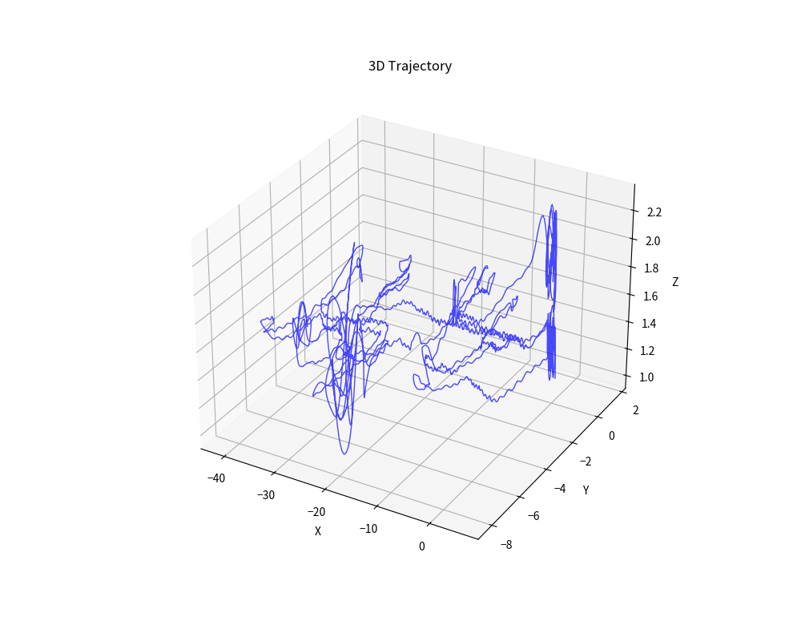
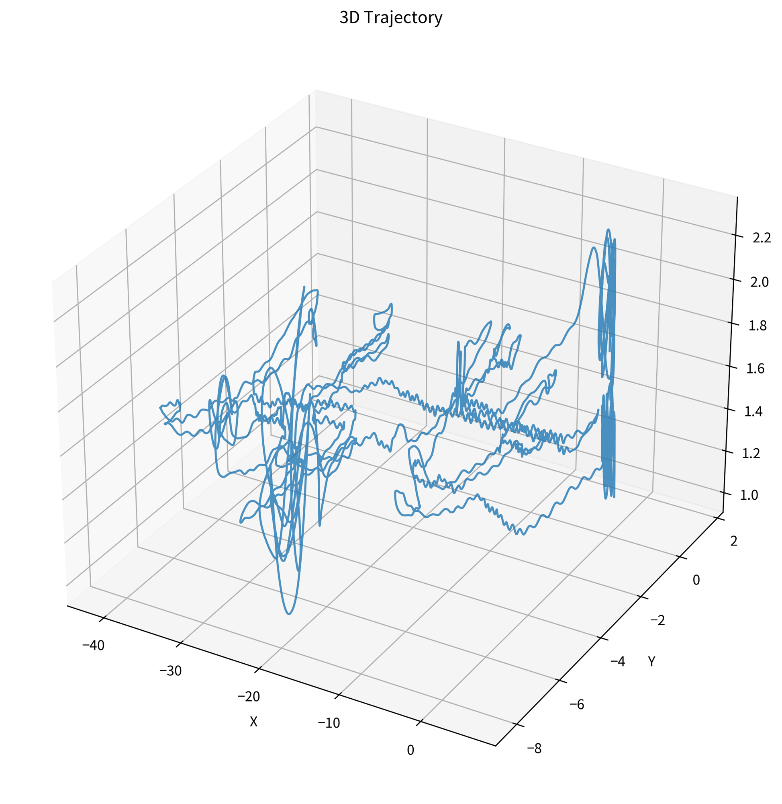

# OpenVINS on Kaggle — No ROS Required

> Visual-Inertial Odometry from scratch: build, patch, and evaluate OpenVINS in a Kaggle notebook with zero ROS dependency.

[](results/)
[](results/)
[](results/)
[](https://www.kaggle.com/)
[](notebook/)

---

## What This Is

This repo demonstrates running [OpenVINS](https://github.com/rpng/open_vins) — a state-of-the-art filter-based Visual-Inertial Odometry system — entirely inside a **Kaggle notebook**, built from source without any ROS installation.

Most OpenVINS tutorials assume a full ROS2 workspace. This project strips that dependency using the `ENABLE_ROS=OFF` CMake flag, patches the simulation binary to export trajectory data, and evaluates accuracy against ground truth — all in Python.

**Dataset:** RPNG Simulation (TUM-VI corridor1 compatible)  
**Estimator:** OpenVINS MSCKF (`run_simulation`, no ROS)  
**Environment:** Kaggle GPU/CPU notebook, Ubuntu 22.04

---

## Results

### Trajectory Statistics

| Metric | Value |
|---|---|
| Trajectory Length | 296.69 m |
| **ATE RMSE** | **0.1687 m** |
| Mean Position Error | 0.1571 m |
| Median Position Error | 0.1573 m |
| Maximum Position Error | 0.4105 m |
| **Relative Trajectory Error** | **0.057 %** |

The estimator tracked a 296.69 m trajectory with a relative error of only **0.057%** — no significant drift or divergence across the full sequence.

> 📊 Interactive 3D visualization available in [`results/openvins_trajectory.html`](results/openvins_trajectory.html)

## Trajectory Visualization

| Estimated Trajectory | Ground Truth |
|---------------------|--------------|
|  |  |

---

## How It Works

### 1. Build OpenVINS Without ROS

```bash
git clone https://github.com/rpng/open_vins.git
cd open_vins/ov_msckf
mkdir build && cd build
cmake .. -DENABLE_ROS=OFF
make -j4
```

The key flag is `-DENABLE_ROS=OFF`. This compiles the standalone `run_simulation` binary with Eigen + OpenCV + Ceres only — no `catkin`, no `colcon`, no ROS bridge.

### 2. Patch `run_simulation.cpp` for Trajectory Export

OpenVINS's simulation binary doesn't write output files by default. The patch in [`patches/run_simulation_patch.cpp`](patches/run_simulation_patch.cpp) adds:

- `trajectory.txt` — estimated IMU position at each timestep `(t, x, y, z)`
- `groundtruth.txt` — ground truth from the simulator's internal state

Key additions to the IMU loop:

```cpp
// After sys->feed_measurement_imu(message_imu):
auto state = sys->get_state();
if (state != nullptr) {
    traj_file << message_imu.timestamp << " "
              << state->_imu->pos()(0) << " "
              << state->_imu->pos()(1) << " "
              << state->_imu->pos()(2) << std::endl;
}

// Ground truth via sim->get_state():
Eigen::Matrix<double,17,1> gt_state;
if (sim->get_state(message_imu.timestamp, gt_state)) {
    gt_file << gt_state(0) << " "
            << gt_state(5) << " "
            << gt_state(6) << " "
            << gt_state(7) << std::endl;
}
```

### 3. Evaluate with Python

```python
import numpy as np, pandas as pd

traj = pd.read_csv("trajectory.txt",   sep=r"\s+", comment="#", header=None, names=["t","x","y","z"])
gt   = pd.read_csv("groundtruth.txt",  sep=r"\s+", comment="#", header=None, names=["t","x","y","z"])

N = min(len(traj), len(gt))
err = np.sqrt((traj.x[:N]-gt.x[:N])**2 + (traj.y[:N]-gt.y[:N])**2 + (traj.z[:N]-gt.z[:N])**2)

print(f"ATE RMSE : {np.sqrt(np.mean(err**2)):.4f} m")
print(f"Mean     : {np.mean(err):.4f} m")
print(f"Max      : {np.max(err):.4f} m")
```

---

## Repo Structure

```
├── notebook/
│   └── vio-openvins.ipynb          # Full Kaggle notebook (runnable)
├── patches/
│   └── run_simulation_patch.cpp    # Modified source with trajectory export
├── config/
│   └── estimator_config.yaml       # rpng_sim config used for this run
├── results/
│   ├── trajectory.txt              # Estimated trajectory (t x y z)
│   ├── groundtruth.txt             # Ground truth (t x y z)
│   ├── openvins_trajectory.html    # Interactive 3D Plotly visualization
│   └── ate_results.txt             # All metrics
└── README.md
```

---

## Reproducing This

1. Open the notebook on Kaggle (or clone and run locally with the same deps)
2. The notebook handles: dataset download → OpenVINS build → patching → run → evaluate
3. Runtime on a Kaggle CPU notebook: ~15–20 min (mostly cmake + make)

**Dependencies** (all available in the Kaggle Python image):
- `cmake`, `make`, `libeigen3-dev`, `libopencv-dev`, `libboost-all-dev`, `libceres-dev`
- Python: `numpy`, `pandas`, `plotly`

---

## Notes on the No-ROS Build

Building OpenVINS without ROS eliminates the largest friction point in most VIO evaluation pipelines. The `ENABLE_ROS=OFF` path compiles `ov_msckf` as a pure CMake project. The tradeoffs:

- ✅ Works in any Linux environment (CI, Kaggle, Docker, bare metal)
- ✅ No workspace sourcing, no `colcon build` failures
- ✅ Fast iteration — just `make -j4` and run
- ⚠️ No `rviz` visualization (replaced here with Plotly)
- ⚠️ No rosbag replay (simulation mode only; for real datasets use the ROS path)

---

## References

- [OpenVINS GitHub](https://github.com/rpng/open_vins)
- [OpenVINS Paper — Geneva et al., ICRA 2020](https://docs.openvins.com/)
- [TUM-VI Dataset](https://vision.in.tum.de/data/datasets/visual-inertial-dataset)
- [RPNG Lab](https://github.com/rpng)
